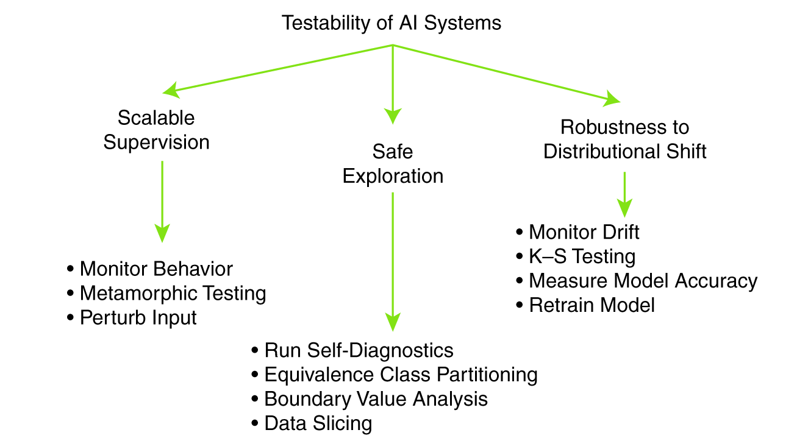

# On the Testability of Artificial Intelligence and Machine Learning Systems
This article examines current testing techniques for the quality assurance of artificial intelligence and machine learning systems. It organizes them based on the granularity of testing level and explores design tactics using these techniques.
You can read the full article [here](https://www.computer.org/csdl/magazine/co/2022/03/09734245/1BLn83g2aw8).

This article's summary is divided in topics that I thought would be good to explicit.
## 1.0 Introduction
Because of AI System's constant behaviour adaptation from the environment in which they operate and their dependability on quality assurance, traditional testing approaches are limited, due to the nondeterministic nature of those systems. 
Repetition of training yields different outcomes with a likelihood of an unintended behavior that can lead to a fault or failure. Testing approaches for checking those behaviours are challenged by three things:

* *Lack of test oracles*: outputs are learned and predicted by a ML model, not a model that is prior to testing.
* *Large input space*: it's difficult to find a test data set that is representative enough.
* *High white-box testing effort*: testing all possible states within ML models of an AI system is intractable.

In the presence of the first two problems, software testing can only detect crashes.

However, software testing is an important part of the software development lifecycle, thus, it's necessary to constantly improve testing of AI Systems.
In systems where programming languages are intrinsic components, traditional software testing can be used.

But software testing of AI Systems isn't limited to detect bugs and crashes, it's also about checking correctness under the assumption of hyphoteses (statistic and probabilistic) and verifying if the outcomes fit the expected behaviour.

## 2.0 Techiniques for testing AI Systems
The article shows a table containing several testing techiniques that have been proposed for testing AI Systems, distributed in four categories according to the level of granularity of the entity being tested, which are:
* *Input Testing*:  analyzes the testing data for potential reasons that can lead to unsuccessful training, like underrepresented data.
* *Model Testing*: can be used to identify inputs for which the model produces wrong predictions by using measures of accuracy for classifiers, measuring hyperparameters, traning process and etc. There are several techiniques specified for this type of testing, and every one tries to overcome one of the problems specified in the previous section.
* *Integration Testing*: this test exercises software components and individual models together to uncover issues that could only be found when the isolated parts work together like, for instance, searchbased testing has been used in autonomous vehicles to detect undesirable feature interactions. 
* *System Testing*: important to validate the behaviour of a complete system in its operational environment. It consists in test all of the components together, including the model, software components, sensors and actuators, environment and other components.

## 3.0 Design tactics for improving the testability of AI Systems
This topic addresses software development tactics in the vision of Software Engineering that can lead to a more robust and easy-to-test AI System. The table shows some of the concerns that a AI System can try to avoid. The authors have given a great ilustration of those concerns by using the example of a cleaning bot. 

> "A robot should not knock off items that it should not disturb while cleaning the room (avoiding a negative side effect); it should not compromise its vision system so it does not have to clean when it can’t see the mess (avoiding reward hacking); it should not throw away valuable items, such as a cell phone on the floor, because it has limited information on what constitutes trash (scalable supervision concern); while deciding to mop a room it should not put a mop in an electrical outlet (safe exploration concern); and it should be able to adapt its cleaning strategies learned in an office to cleaning a factory floor (showing robustness to distributed shift). Testing strategies need to be in place to ensure that an AI system is not vulnerable to these risks, and that it behaves as intended."

By using this example, we can easily build an AI System that can be easy to test and to be improved.

## 4.0 Testing Monitor
The authors say that the design tactics shown in last section serve the purpose of allowing easy testing by controlling and observing their behaviour through a testing monitor.

A testing monitor uses data produced my a ML Model to evaluate and test. It has three core "tasks":
* *Monitor behaviour*: validate the runtime behavior of the ML model and also writes the user request (input data) along with the model prediction (output data) to a logger, which saves these data to a persistent store.
* *Monitor drift*: scheduled to run periodically on the aggregated user input data for that period to see if the model performance has drifted to a level where it may need retraining. 
* *Run Self-diagnostics*: performs diagnostics on the ML model on a periodic schedule to ensure that the retrained model continues to operate as expected.

The authors also bring an example of a ML Model that is used for adjudicating loans to applicants while minimizing the risk of losing money.

In this example they show various cases where design tactics were crucial to help using the techiniques discussed in section 2.0.

In the next figure, we can see a testability design tactics catalog shown in the end of the article.

## 5.0 Conclusion
By reading this article I really could dive into the AI System's testing world. Until then, I never realized how to properly test, for instance, a ML Model. I surely knew some metrics like accuracy and dispersion matrix, but I really didn't know formal techiniques to do so. In the future, I hope to use some of those techiniques myself when reaching the system testing part of the software lifecycle.